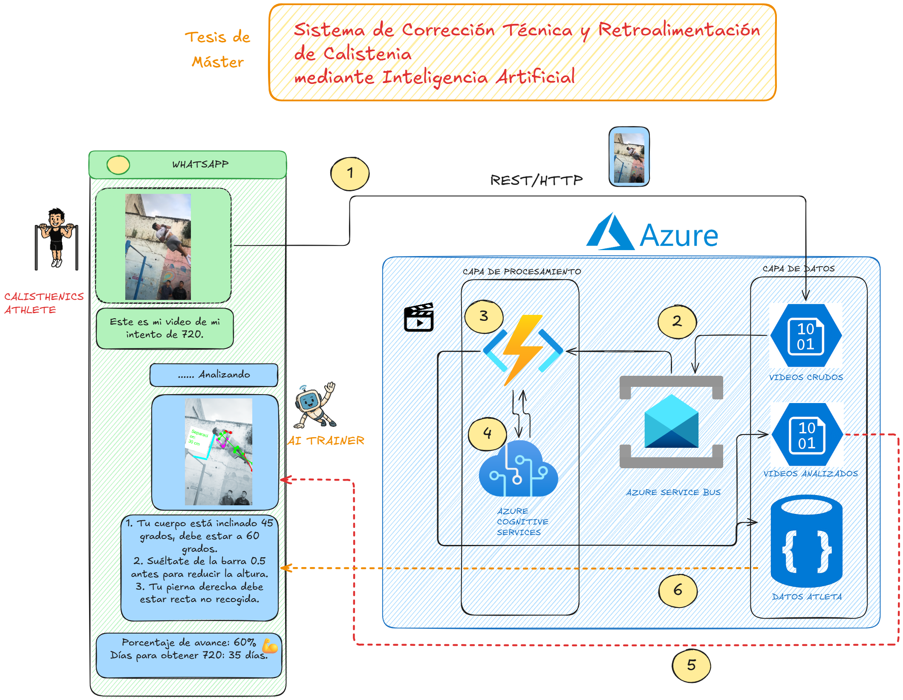
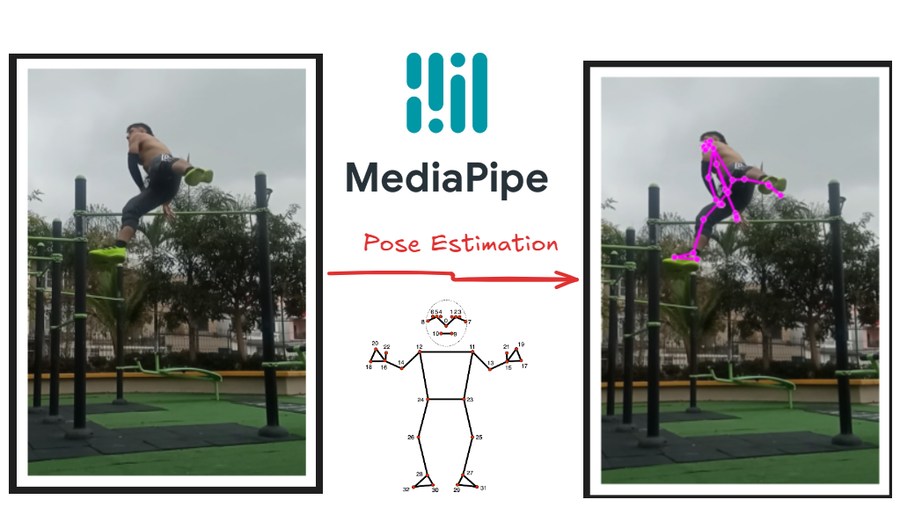

# AI Assistant for Calisthenics Self-Training: Swing 720
This is the AI Assistant architecture for Calisthenics Self-Traning.

## Objectives
- Provide concrete, actionable feedback and cues for calisthenics athletes. (arms angle, head and shoulder positioning, among others).
- Available through WhatsApp to ease athletes interactions.
- Cloud infrastructure and costs analysis.
- Ensure data privacy.

## System Architecture Diagram 

## Pose estimation
Pose estimation was made using MediaPipe and opencv. This model adjusts quite perfect for our use case, because it only analyzes one person at a time and it is quite efficient. Calisthenics is an individual sport, so detecting more than one person is not necessary.

